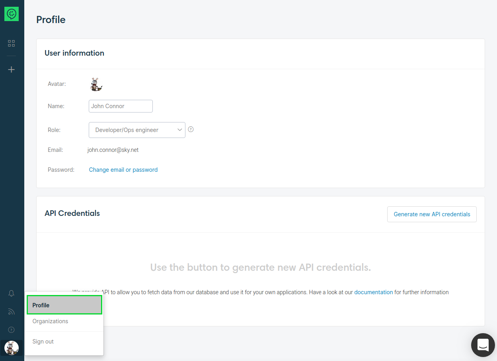
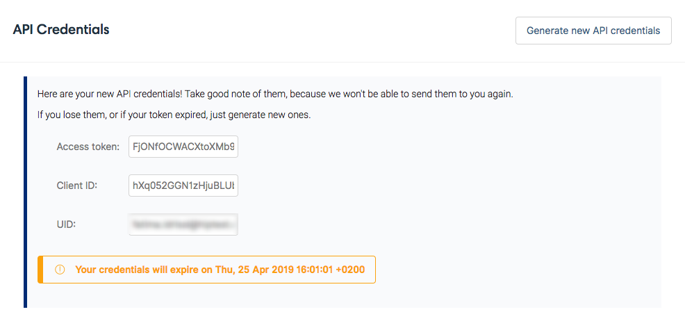
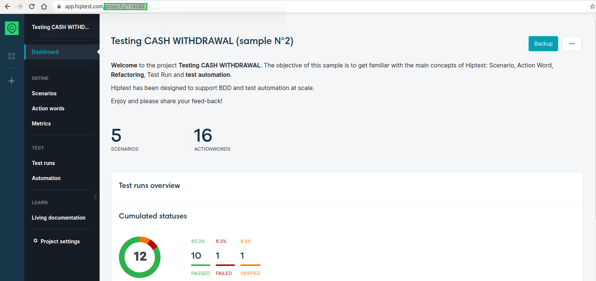

# Introduction

Welcome to the <a href="https://hiptest.com">Hiptest</a> API! You can use our
API endpoints to get information on your projects in our database. It is
RESTful and follows the [{json:api}](http://jsonapi.org) specification.

Since we don't provide integration with any programming languages (yet!), the
examples are written in shell, using the curl command.

Our API documentation was created with [Slate](https://github.com/tripit/slate).

## API rate limits

```http
HTTP/1.1 429 Too Many Requests
Retry-After: 42
```

```shell
HTTP/1.1 429 Too Many Requests
# snip #
Retry-After: 42
# snip #
```

Your application can make up to **200** API requests **per minute**.

Once the limit is exceeded, clients receive an HTTP 429 with a `Retry-After: X`
header to indicate how long their timeout period is before they will be able to
send requests again. The timeout period is set to 60 seconds once the limit is
exceeded.

### Note

The rate limit is based on the IP address.


# Getting Started

This little tutorial will guide you to request our API for the first time.

## Your API credentials

Before accessing our API you need to generate your API credentials. Sign in to
your account on [Hiptest.com](https://hiptest.com) then go to
[your profile page](https://app.hiptest.com/profile). Click the
`Generate new API credentials` button.





## Your first request

> Replace `$PROJECT_ID`, `$ACCESS_TOKEN`, `$CLIENT_ID` and `$UID`
> with yours

```http
GET https://app.hiptest.com/api/projects/$PROJECT_ID/scenarios HTTP/1.1
Accept: application/vnd.api+json; version=1
access-token: $ACCESS_TOKEN
client: $CLIENT_ID
uid: $UID
```
```http
HTTP/1.1 200 OK
Content-Type: application/vnd.api+json
```

```shell
curl https://app.hiptest.com/api/projects/$PROJECT_ID/scenarios \
	-H 'Accept: application/vnd.api+json; version=1' \
	-H 'access-token: $ACCESS_TOKEN' \
	-H 'client: $CLIENT_ID' \
	-H 'uid: $UID'
```
```json
{
  "data": [
    {
      "type": "scenarios",
      "id": "668555",
      "attributes": {
        "name": "Card has been disabled (1)",
        "description": "An error is displayed when the cart has been disabled"
      },
      "links": {
        "self": "/scenarios/668555"
      }
    },
    {
      "type": "scenarios",
      "id": "668556",
      "attributes": {
        "name": "Account has sufficient funds for transferring cash (1)",
        "description": ""
      },
      "links": {
        "self": "/scenarios/668556"
      }
    }
  ]
}
```

For your first request, you'll need your [API credentials](#your-api-credentials),
and **a project ID**. All the API endpoints depend on a project. You can
retrieve their ID in the address bar of your browser while you are viewing the
dashboard of your project.

In the following example we are looking for the ID of the sample project
`Testing CASH WITHDRAWAL`: the ID is 40849.



Now to retrieve all the scenarios of your project use the endpoint
`api/projects/$PROJECT_ID/scenarios`. The HTTP call looks
like the following:

`GET https://app.hiptest.com/api/projects/$PROJECT_ID/scenarios`

Replace the $PROJECT_ID with the ID of one of your project. The following
headers MUST be part of the query:

- `Accept: application/vnd.api+json; version=1`
- `access-token: $ACCESS_TOKEN` (replace $ACCESS_TOKEN with your access token)
- `client: $CLIENT_ID` (replace $CLIENT_ID with your client ID)
- `uid: $UID` (replace $UID with your UID)

Every requests to the API must include those 4 headers.

The access token, the client ID and the UID are your
[API Credentials](#your-api-credentials).

The header `Accept` tells the API to respond using the
[{json:api}](http://jsonapi.org) format and asks for the version 1 of the API.

## Renewing your API Credentials

> Replace `$EMAIL_ADDRESS` and `$PASSWORD` with your Hiptest credentials

```http
POST https://app.hiptest.com/api/auth/sign_in HTTP/1.1
Content-Type: application/json

{"email": "$EMAIL_ADDRESS", "password": "$PASSWORD"}
```
```http
HTTP/1.1 200 OK
Content-Type: application/json; charset=utf-8
access-token: iHr2dTV-UBK3Xa9vXOXERA
token-type: Bearer
client: TscNP_R2vdAV-yQc8ZjftQ
expiry: 1518274095
uid: ...@...
```

```shell
curl -XPOST https://app.hiptest.com/api/auth/sign_in \
	-H 'Content-Type: application/json' \
	-d '{"email": "$EMAIL_ADDRESS", "password": "$PASSWORD"}' \
	-D /dev/stdout

HTTP/1.1 200 OK
# some response headers have been sniped
access-token: iHr2dTV-UBK3Xa9vXOXERA
token-type: Bearer
client: TscNP_R2vdAV-yQc8ZjftQ
expiry: 1518274095
uid: ...@...
# other response headers have been sniped
```

```json
{
  "data": [
    {
    	...
    }
  ]
}
```

Your access token, as explain on your profile page after it has been generated,
will expire. You can generate a new one on your profile page by clicking the
`Generate new API credentials` button again, but it is also possible to manage
it programmaticaly, using the API.

To generate or renew your API credentials use this endpoint: `api/auth/sign_in`.

`POST https://app.hiptest.com/api/auth/sign_in`

Post your Hiptest credentials (email and password) encoded as JSON. If you have
been successfully authenticated your API credentials will be in the response
headers within the keys `access-token`, `client` and `uid`. The `expiry` header
is the expiration timestamp of your new token.
